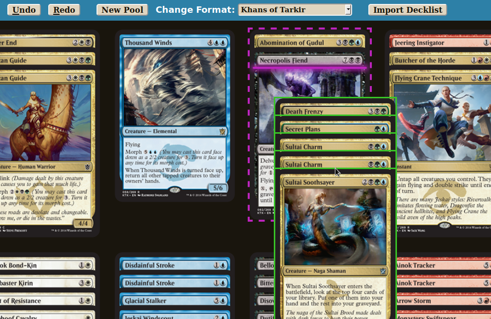

# Arcane Lab

The Arcane Lab is a webapp that lets you build Magic: the Gathering sealed pools by arranging cards into piles very similarly to how you do in real life.
Visit [the production version][prod] to see it in action!
Currently, it only works on desktop browsers and not on mobile ones.



[prod]: http://labmaniac.com

The frontend is written in ClojureScript using concepts from Elm by way of [Zelkova][zelkova] to manage state, and [Om][om] to render the state using React under the hood.
The backend is written in JVM Clojure.

[zelkova]: https://github.com/jamesmacaulay/zelkova
[om]: https://github.com/omcljs/om

## Developing

First off, you'll need to have [leiningen][lein] installed,
For development, you'll want to start from the master branch for quick ClojureScript compilation.
Run this command to compile the frontend:
```sh
lein cljsbuild auto
```
This process will keep running to re-compile whenever a one of the source files is saved.

In another terminal session, run this command to start the development server:
```sh
lein ring server
```
When it's ready, it'll automatically open the site in your default browser.
The server will recompile any changed namespaces when you reload the page, though I have sometimes gotten into states where I needed to stop and restart it to fix an error or update state.

[lein]: (https://github.com/technomancy/leiningen)

### Updating for New Sets

The card definitions are loaded statically from `resources/cards-by-set.json`, which is the AllSets.json file from [mtgjson.com](http://mtgjson.com).
If a new set contains no fundamentally new card concepts nor an unusual booster slot (such as the guaranteed double-faced card slot in Innistrad booster packs), then updating Arcane Lab to include it is pretty short work:
  * Download a new AllSets.json from mtgjson.com and rename it appropriately.
  * Add the new set's 3-letter set code to the `sets-that-work` set literal in `src/cljc/arcane_lab/sets.cljc`.
  * If the set is a small set, add a mapping between the set's 3-letter code and the booster spec that describes its sealed format, e.g. '4HOU2AKH' for Hour of Devastation's sealed format of 4 Hour of Devastation plus 2 Amonkhet packs (this is unnecessary for large sets, whose sealed format is always six packs of that set).
  * Change the root route in `src/clj/arcane_lab/site.clj` to redirect to the booster spec for the new set's sealed format.
  * These days, all the new sets contain extra cards that are printed in Planeswalker decks but not in booster packs. These extra cards need to be filtered out of the booster packs, which is done by adding an entry to the `extraneous-card-predicate` map in `src/clj/arcane_lab/cards.cljs`, with the set's three-letter code as the key and an predicate that returns true for cards with a :number greater than the official number of cards in the set (the extra Planeswalker deck cards all have collector numbers like '272/269').

On the other hand, if a new set *does* contain a fundamentally new concept that affects how cards are displayed or sorted, or a booster slot that only contains a certain subset of cards in the set, or even a slot with a chance that it will have a card from that special subset (as with the sometimes-DFC slot in Shadows Over Innistrad booster packs), then Arcane Lab will need to be updated to handle it.
Some recent examples of this have been the double-faced cards in Shadows Over Innistrad, the devoid cards in Battle for Zendikar, and the special land slot in Fate Reforged booster packs that always contained a two-color land.
One that I can predict is that the next time the split card frame is used, I want to change those cards to display horizontally when dragged (perhaps in addition to the normal orientation, similarly to how double-faced cards have their back face displayed), since turning your head sideways is a pain in the neck.

I plan to be updating Arcane Lab for the foreseeable future, so this documentation is mostly for myself.
Sometimes I am too busy to get to it the week before the prerelease when the set goes up on Gatherer, so you can always give it a shot yourself.
If it's more than just a routine update, please [open a GitHub issue][gh-issues] to coordinate the work.

[gh-issues]: https://github.com/aperiodic/arcane-lab/issues

## Nitty Gritty Details of Pack Creation

Arcane Lab emulates print runs in order to better match the distribution of cards you find in real Magic booster packs.
Before generating the booster packs in a pool, Arcane Lab creates print sheets for commons, uncommons, and rares; and if necessary a sheet for any special cards in the sheet that are printed on their own sheet (usually these are double-faced cards).
It then takes cards sequentially from each set as needed to fill up each booster pack.

The sheets are completely random: not only are there not Hall-of-Fame players deciding the order in which cards appear on the sheets, no attempt is made even to balance the number of colors that appear in any particular subsection of the sheet.
This means that while these packs result in more accurate sealed pools than simply selecting the appropriate number of commons, uncommons, and rares at random, there is more variance in color distribution and power level in packs from Arcane Lab than in retail magic packs.
The net result of this greater variance is that while you can get both worse and better pools than you'd get from retail booster packs, on average they're better since often one color will have many cards and another will have so few as to be clearly unplayable.

After each booster pack is created, there is a small chance that the current print sheets will be thrown away and new ones generated for the remaining booster packs.
This happens at most once for each set of packs in the pool that share a set.
Clearly, the sheets will be changed when the next booster pack is from a different set.

If you're curious, read even more about Magic print sheets at [the MtG Salvation wiki][print-sheets].

[print-sheets]: https://mtg.gamepedia.com/Print_sheet
